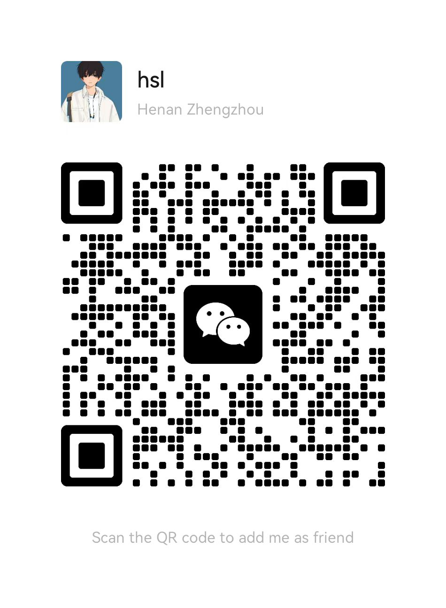

# a chat bot for girlfirend
a chat bot for girlfirend
是一个集成了api、网络爬虫、本地搜索和深度学习的聊天机器人。它可以使用用户的微信给微信列表的任何一个联系人自动发送消息，并支持多轮对话。

**如果这个项目很有意思，帮忙右上角点个 star✨ 支持我 ❤❤**

详细功能如下：

- **每日早晨问候**
- **土味情话**
- **脑筋急转弯**
- **每日/明日/每周/每年星座运势**
- **每日晚上问候**
- **基于GPT2的多轮对话（在40w对话语录上进行训练，然后使用微信聊天记录进行微调）**
- **支持本地化和服务器（推荐）部署每天定时发送**

---

## 运行环境
python3.6、 transformers==4.6.6、pytorch==1.9.0
## 项目结构
- model_dir:存放摘要生成的模型
- love_api.py:各种推送语录的细节调节
- interact.py:测试gpt2代码
- sql.txt:存放各种问题和答案的数据库
- main.py:主文件，直接运行即可
## 使用方法
sql配置方法：将问题与答案按照下面的格式输入到sql.txt中即可
```python
你的名字是？	我的名字是xxx。
你几岁啦？	1岁了。
```
使用方法：登录微信并打开窗口，将下面的xxx换成某人即可
```python
girl_friend=Cj("xxx")#输入发送人的微信备注
```

## 联系作者
- 邮件我：shulehao@gmail.com
- 微信我：加我*微信号：caojuan021112*, 进Python-NLP交流群，备注：*姓名-公司名-NLP*


